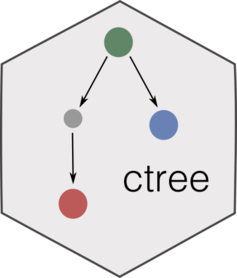

# ctree <a href="https://caravagnalab.github.io/ctree/"></a>

<!-- badges: start -->

[](https://github.com/caravagnalab/ctree/actions)
[](https://github.com/caravagnalab/ctree/actions/workflows/pkgdown.yaml)
[](https://www.tidyverse.org/lifecycle/#stable)
<!-- badges: end -->

The `ctree` package implements clones trees for cancer evolutionary
studies. These models are built from Cancer Cell Franctions (CCFs)
clusters computed via tumour subclonal deconvolution, using either one
or more tumour biopsies at once. They can be used to model evolutionary
trajectories from bulk sequencing data, especially if whole-genome
sequencing is available. The package implements S3 objects for the
mutation trees, as well as a Monte Carlo sampler to generate them, as
well as functions to plot and analyze the trees. The sibling of a clone
tree is a mutation tree, which is built from binary mutation profiles;
refer to the [mtree package](https://caravagn.github.io/mtree) for
mutation trees.

#### Citation

[](https://doi.org/10.1038/s41592-018-0108-x)

Please cite this if you use `ctree`:

-   G. Caravagna, Y. Giarratano, D. Ramazzoti, I. Tomlinson, T.A.
    Graham, G. Sanguinetti, A. Sottoriva. *Detecting repeated cancer
    evolution from multi-region tumor sequencing data.* Nature Methods
    15, 707–714 (2018).

#### Help and support

[](https://caravagnalab.github.io/ctree)

------------------------------------------------------------------------

### Installation

You can install the released version of `ctree` with:

``` r
# install.packages("devtools")
devtools::install_github("caravagnalab/ctree")
```

------------------------------------------------------------------------

#### Copyright and contacts

Giulio Caravagna. Cancer Data Science (CDS) Laboratory.

[](https://github.com/caravagnalab)
[](https://www.caravagnalab.org/)
