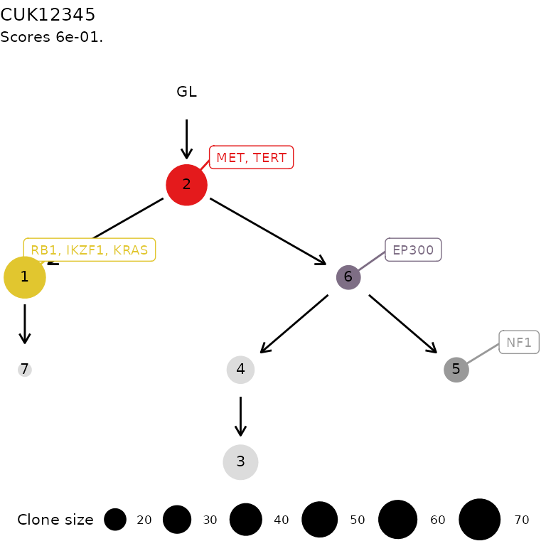
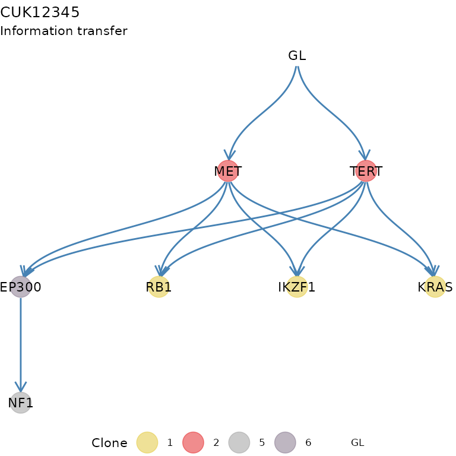
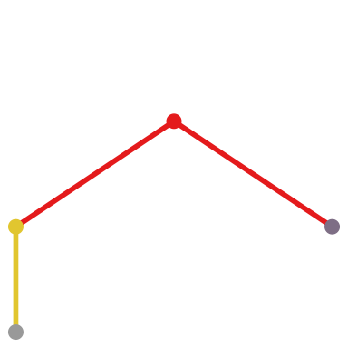
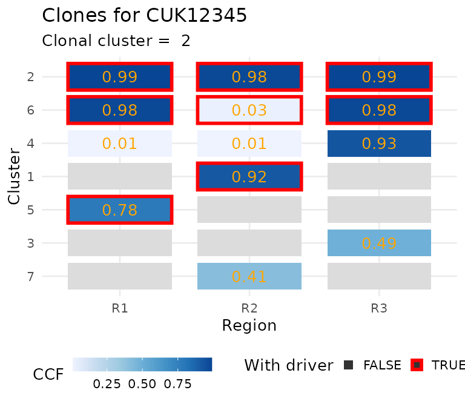
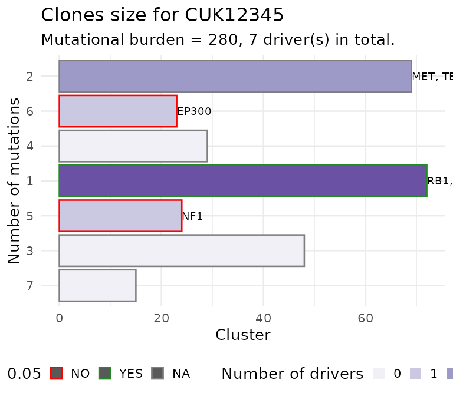

# ctree

``` r

# To render in colour this vignette
old.hooks <- fansi::set_knit_hooks(knitr::knit_hooks)
```

The `ctree` is a package to implement basic functions to create,
manipulate and visualize clone trees. A clone tree is a tree built from
the results of a subclonal deconvolution analysis of bulk DNA sequencing
data. The trees created with `ctree` are used inside
[REVOLVER](https://github.com/caravagn/revolver), a package that
implements one algorithm to determine [repeated cancer evolution from
multi-region sequencing data of human
cancers](https://www.nature.com/articles/s41592-018-0108-x).

``` r

library(ctree)
```

To build a clone tree you need some basic datal; an example dataset is
attached to the package and can be used to create a `ctree` S3 object.

``` r

data('ctree_input')
```

### Required data

**Cancer Cell Fractions**

Cancer Cell Fractions (CCF) clusters obtained from subclonal
deconvolution analysis of bulk DNA sequencing data are required,

``` r

ctree_input$CCF_clusters
```

``` fansi
#> # A tibble: 7 × 7
#>   cluster nMuts is.driver is.clonal    R1    R2    R3
#>   <chr>   <int> <lgl>     <lgl>     <dbl> <dbl> <dbl>
#> 1 1          72 TRUE      FALSE      0     0.92  0   
#> 2 2          69 TRUE      TRUE       0.99  0.98  0.99
#> 3 3          48 FALSE     FALSE      0     0     0.49
#> 4 4          29 FALSE     FALSE      0.01  0.01  0.93
#> 5 5          24 TRUE      FALSE      0.78  0     0   
#> 6 6          23 TRUE      FALSE      0.98  0.03  0.98
#> 7 7          15 FALSE     FALSE      0     0.41  0
```

If you need tools to compute CCF values, the
[evoverse](https://caravagn.github.io/evoverse/) collection of packages
for Cancer Evolution analysis contains both
[MOBSTER](https://caravagn.github.io/mobster/) and
[VIBER](https://caravagn.github.io/viber/). Otherwise, a number of other
packages can be used (pyClone, sciClone, DPClust, etc.).

Driver events mapped to the CCF clusters, with reported clonality
status, a `variantID` and a `patientID.`

``` r

ctree_input$drivers
```

``` fansi
#> # A tibble: 7 × 8
#>   patientID variantID is.driver is.clonal cluster    R1    R2    R3
#>   <chr>     <chr>     <lgl>     <lgl>     <chr>   <dbl> <dbl> <dbl>
#> 1 CRUK0002  RB1       TRUE      FALSE     1        0     0.92  0   
#> 2 CRUK0002  IKZF1     TRUE      FALSE     1        0     0.92  0   
#> 3 CRUK0002  KRAS      TRUE      FALSE     1        0     0.93  0   
#> 4 CRUK0002  MET       TRUE      TRUE      2        0.99  0.98  0.99
#> 5 CRUK0002  TERT      TRUE      TRUE      2        0.99  0.98  0.99
#> 6 CRUK0002  NF1       TRUE      FALSE     5        0.78  0     0   
#> 7 CRUK0002  EP300     TRUE      FALSE     6        0.96  0.03  0.98
```

**Other data**

``` r

ctree_input$samples
#> [1] "R1" "R2" "R3"
ctree_input$patient
#> [1] "CUK12345"
```

### Creation of a clone tree

#### Sampling trees with `ctrees`

The easiest way to obtain one or more clone trees that are compatible
with the input CCF clusters is to use the `ctrees` sampler, which
explores the space of trees compatible with the data and ranks them by a
score that penalises violations of the pigeonhole principle (see
[`?ctrees`](https://caravagnalab.github.io/ctree/reference/ctrees.md)).

``` r

trees = ctrees(
  CCF_clusters = ctree_input$CCF_clusters,
  drivers = ctree_input$drivers,
  samples = ctree_input$samples,
  patient = ctree_input$patient,
  sspace.cutoff = ctree_input$sspace.cutoff,
  n.sampling = ctree_input$n.sampling,
  store.max = ctree_input$store.max
)
```

``` fansi
#>  [ ctree ~ clone trees generator for CUK12345 ] 
#> 
#> # A tibble: 7 × 7
#>   cluster nMuts is.driver is.clonal    R1    R2    R3
#>   <chr>   <int> <lgl>     <lgl>     <dbl> <dbl> <dbl>
#> 1 1          72 TRUE      FALSE      0     0.92  0   
#> 2 2          69 TRUE      TRUE       0.99  0.98  0.99
#> 3 3          48 FALSE     FALSE      0     0     0.49
#> 4 4          29 FALSE     FALSE      0.01  0.01  0.93
#> 5 5          24 TRUE      FALSE      0.78  0     0   
#> 6 6          23 TRUE      FALSE      0.98  0.03  0.98
#> 7 7          15 FALSE     FALSE      0     0.41  0
```

    #> ✔ Trees per region 1, 3, 1
    #> ℹ Total 3 tree structures - search is exahustive
    #> 
    #> ── Ranking trees
    #> ✔ 3  trees with non-zero score, storing 3

The sampler’s behaviour is controlled by three parameters:

- `sspace.cutoff`: if the number of tree structures compatible with the
  data is smaller than this cutoff, every structure is examined
  exhaustively. Otherwise a Monte Carlo sampler is used.
- `n.sampling`: when the Monte Carlo sampler is used, this many distinct
  trees are sampled and scored.
- `store.max`: the maximum number of ranked trees that are returned to
  the user.

`ctrees` always returns a `list` of objects of class `ctree`, ordered by
decreasing score (the best tree first).

``` r

length(trees)
#> [1] 3
sapply(trees, function(x) x$score)
#>          1          2          3 
#> 0.60000000 0.06666667 0.06666667
```

We work with the top-ranking model.

``` r

x = trees[[1]]
```

#### The structure of a `ctree` object

A `ctree` object is a named list that fully describes one clone tree fit
to the input data.

``` r

names(x)
#>  [1] "adj_mat"    "tb_adj_mat" "score"      "patient"    "samples"   
#>  [6] "drivers"    "CCF"        "transfer"   "annotation" "tree_type"
```

The main fields are:

- `adj_mat`: the adjacency matrix of the tree, including a special `GL`
  (germline) node that is always the root of the tree;

``` r

x$adj_mat
#>    2 1 6 4 GL 7 5 3
#> 2  0 1 1 0  0 0 0 0
#> 1  0 0 0 0  0 1 0 0
#> 6  0 0 0 1  0 0 1 0
#> 4  0 0 0 0  0 0 0 1
#> GL 1 0 0 0  0 0 0 0
#> 7  0 0 0 0  0 0 0 0
#> 5  0 0 0 0  0 0 0 0
#> 3  0 0 0 0  0 0 0 0
```

- `tb_adj_mat`: the same tree represented as a `tidygraph`/`tbl_graph`
  object, annotated with the CCF, sample attachment and driver
  information for each node – this is what the plotting functions use;

``` r

x$tb_adj_mat
```

``` fansi
#> # A tbl_graph: 8 nodes and 7 edges
#> #
#> # A rooted tree
#> #
#> # Node Data: 8 × 9 (active)
#>   cluster nMuts is.driver is.clonal    R1    R2    R3 attachment driver         
#>   <chr>   <int> <lgl>     <lgl>     <dbl> <dbl> <dbl> <chr>      <chr>          
#> 1 2          69 TRUE      TRUE       0.99  0.98  0.99 NA         MET, TERT      
#> 2 1          72 TRUE      FALSE      0     0.92  0    NA         RB1, IKZF1, KR…
#> 3 6          23 TRUE      FALSE      0.98  0.03  0.98 NA         EP300          
#> 4 4          29 FALSE     FALSE      0.01  0.01  0.93 NA         NA             
#> 5 GL         NA NA        NA        NA    NA    NA    NA         NA             
#> 6 7          15 FALSE     FALSE      0     0.41  0    NA         NA             
#> 7 5          24 TRUE      FALSE      0.78  0     0    NA         NF1            
#> 8 3          48 FALSE     FALSE      0     0     0.49 NA         NA             
#> #
#> # Edge Data: 7 × 2
#>    from    to
#>   <int> <int>
#> 1     1     2
#> 2     1     3
#> 3     2     6
#> # ℹ 4 more rows
```

- `transfer`: the *information transfer* of the tree, i.e. the set of
  trajectories among driver events implied by the tree topology (see the
  [REVOLVER](https://github.com/caravagn/revolver) paper for details);

``` r

x$transfer$drivers
```

``` fansi
#> # A tibble: 11 × 2
#>    from  to   
#>    <chr> <chr>
#>  1 MET   RB1  
#>  2 MET   IKZF1
#>  3 MET   KRAS 
#>  4 TERT  RB1  
#>  5 TERT  IKZF1
#>  6 TERT  KRAS 
#>  7 GL    MET  
#>  8 GL    TERT 
#>  9 EP300 NF1  
#> 10 MET   EP300
#> 11 TERT  EP300
```

- `score`: the score assigned to this tree by the sampler;

``` r

x$score
#> [1] 0.6
```

- `annotation`: a free-text annotation for the tree, used for instance
  as a title by some plotting functions.

``` r

x$annotation
#> [1] "ctree rank 1/3 for CUK12345"
```

### Manual construction of a clone tree

If you already know the tree structure that you want to use – for
instance because it was determined by another tool, or because you want
to test a specific hypothesis – you can build a `ctree` object directly
with `ctree`, passing the adjacency matrix `M` that you want to use (see
[`?ctree`](https://caravagnalab.github.io/ctree/reference/ctree.md)).

Here we reuse the adjacency matrix of the tree sampled above, after
removing the `GL` node that `ctree` adds automatically.

``` r

M = x$adj_mat
M = M[rownames(M) != 'GL', colnames(M) != 'GL']

print(M)
#>   2 1 6 4 7 5 3
#> 2 0 1 1 0 0 0 0
#> 1 0 0 0 0 1 0 0
#> 6 0 0 0 1 0 1 0
#> 4 0 0 0 0 0 0 1
#> 7 0 0 0 0 0 0 0
#> 5 0 0 0 0 0 0 0
#> 3 0 0 0 0 0 0 0

y = ctree(
  CCF_clusters = ctree_input$CCF_clusters,
  drivers = ctree_input$drivers,
  samples = ctree_input$samples,
  patient = ctree_input$patient,
  M = M,
  score = 1,
  annotation = "A manually constructed clone tree"
)

print(y)
```

``` fansi
#>  [ ctree - A manually constructed clone tree ] 
#> 
#> # A tibble: 7 × 7
#>   cluster nMuts is.driver is.clonal    R1    R2    R3
#>   <chr>   <int> <lgl>     <lgl>     <dbl> <dbl> <dbl>
#> 1 1          72 TRUE      FALSE      0     0.92  0   
#> 2 2          69 TRUE      TRUE       0.99  0.98  0.99
#> 3 3          48 FALSE     FALSE      0     0     0.49
#> 4 4          29 FALSE     FALSE      0.01  0.01  0.93
#> 5 5          24 TRUE      FALSE      0.78  0     0   
#> 6 6          23 TRUE      FALSE      0.98  0.03  0.98
#> 7 7          15 FALSE     FALSE      0     0.41  0   
#> 
#> Tree shape (drivers annotated)  
#> 
#>   \-GL
#>    \-2 :: MET, TERT
#>     |-1 :: RB1, IKZF1, KRAS
#>     | \-7
#>     \-6 :: EP300
#>      |-4
#>      | \-3
#>      \-5 :: NF1
#> 
#> Information transfer  
#> 
#>    MET ---> RB1 
#>    MET ---> IKZF1 
#>    MET ---> KRAS 
#>    TERT ---> RB1 
#>    TERT ---> IKZF1 
#>    TERT ---> KRAS 
#>    GL ---> MET 
#>    GL ---> TERT 
#>    EP300 ---> NF1 
#>    MET ---> EP300 
#>    TERT ---> EP300 
#> 
#> Tree score 1 
#> 
```

### Visualisations

S3 functions for printing, and summarizing the object.

``` r

print(x)
```

``` fansi
#>  [ ctree - ctree rank 1/3 for CUK12345 ] 
#> 
#> # A tibble: 7 × 7
#>   cluster nMuts is.driver is.clonal    R1    R2    R3
#>   <chr>   <int> <lgl>     <lgl>     <dbl> <dbl> <dbl>
#> 1 1          72 TRUE      FALSE      0     0.92  0   
#> 2 2          69 TRUE      TRUE       0.99  0.98  0.99
#> 3 3          48 FALSE     FALSE      0     0     0.49
#> 4 4          29 FALSE     FALSE      0.01  0.01  0.93
#> 5 5          24 TRUE      FALSE      0.78  0     0   
#> 6 6          23 TRUE      FALSE      0.98  0.03  0.98
#> 7 7          15 FALSE     FALSE      0     0.41  0   
#> 
#> Tree shape (drivers annotated)  
#> 
#>   \-GL
#>    \-2 :: MET, TERT
#>     |-1 :: RB1, IKZF1, KRAS
#>     | \-7
#>     \-6 :: EP300
#>      |-4
#>      | \-3
#>      \-5 :: NF1
#> 
#> Information transfer  
#> 
#>    MET ---> RB1 
#>    MET ---> IKZF1 
#>    MET ---> KRAS 
#>    TERT ---> RB1 
#>    TERT ---> IKZF1 
#>    TERT ---> KRAS 
#>    GL ---> MET 
#>    GL ---> TERT 
#>    EP300 ---> NF1 
#>    MET ---> EP300 
#>    TERT ---> EP300 
#> 
#> Tree score 0.6 
#> 
```

``` r

summary(x)
```

``` fansi
#>  [ ctree - ctree rank 1/3 for CUK12345 ] 
#> 
#> # A tibble: 7 × 7
#>   cluster nMuts is.driver is.clonal    R1    R2    R3
#>   <chr>   <int> <lgl>     <lgl>     <dbl> <dbl> <dbl>
#> 1 1          72 TRUE      FALSE      0     0.92  0   
#> 2 2          69 TRUE      TRUE       0.99  0.98  0.99
#> 3 3          48 FALSE     FALSE      0     0     0.49
#> 4 4          29 FALSE     FALSE      0.01  0.01  0.93
#> 5 5          24 TRUE      FALSE      0.78  0     0   
#> 6 6          23 TRUE      FALSE      0.98  0.03  0.98
#> 7 7          15 FALSE     FALSE      0     0.41  0   
#> 
#> Tree shape (drivers annotated)  
#> 
#>   \-GL
#>    \-2 :: MET, TERT
#>     |-1 :: RB1, IKZF1, KRAS
#>     | \-7
#>     \-6 :: EP300
#>      |-4
#>      | \-3
#>      \-5 :: NF1
#> 
#> Information transfer  
#> 
#>    MET ---> RB1 
#>    MET ---> IKZF1 
#>    MET ---> KRAS 
#>    TERT ---> RB1 
#>    TERT ---> IKZF1 
#>    TERT ---> KRAS 
#>    GL ---> MET 
#>    GL ---> TERT 
#>    EP300 ---> NF1 
#>    MET ---> EP300 
#>    TERT ---> EP300 
#> 
#> Tree score 0.6 
#> 
#> CCF clusters:  
#> 
#> # A tibble: 7 × 7
#>   cluster nMuts is.driver is.clonal    R1    R2    R3
#>   <chr>   <int> <lgl>     <lgl>     <dbl> <dbl> <dbl>
#> 1 1          72 TRUE      FALSE      0     0.92  0   
#> 2 2          69 TRUE      TRUE       0.99  0.98  0.99
#> 3 3          48 FALSE     FALSE      0     0     0.49
#> 4 4          29 FALSE     FALSE      0.01  0.01  0.93
#> 5 5          24 TRUE      FALSE      0.78  0     0   
#> 6 6          23 TRUE      FALSE      0.98  0.03  0.98
#> 7 7          15 FALSE     FALSE      0     0.41  0   
#> 
#> Drivers:  
#> 
#> # A tibble: 7 × 8
#>   patientID variantID is.driver is.clonal cluster    R1    R2    R3
#>   <chr>     <chr>     <lgl>     <lgl>     <chr>   <dbl> <dbl> <dbl>
#> 1 CRUK0002  RB1       TRUE      FALSE     1        0     0.92  0   
#> 2 CRUK0002  IKZF1     TRUE      FALSE     1        0     0.92  0   
#> 3 CRUK0002  KRAS      TRUE      FALSE     1        0     0.93  0   
#> 4 CRUK0002  MET       TRUE      TRUE      2        0.99  0.98  0.99
#> 5 CRUK0002  TERT      TRUE      TRUE      2        0.99  0.98  0.99
#> 6 CRUK0002  NF1       TRUE      FALSE     5        0.78  0     0   
#> 7 CRUK0002  EP300     TRUE      FALSE     6        0.96  0.03  0.98
#> 
#> Pigeonhole principle: 12 0 
#> 
#>     R1   R2   R3
#> 1 TRUE TRUE TRUE
#> 2 TRUE TRUE TRUE
#> 4 TRUE TRUE TRUE
#> 6 TRUE TRUE TRUE
#> 
#> Goodness-of-fit: 1  
#> 
#> 
```

Then some plotting functions for the tree. A tree layout is used to
display the clone tree and the information transfer, which corresponds
to the ordering of the drivers annnotated in the tree. This terminology
is borrowed from the [REVOLVER](https://github.com/caravagn/revolver)
algorithm, where it is used to refer to the set of trajectories that a
patient “transfers” to another patient during the fit.

``` r

plot(x)
```



``` r

plot_information_transfer(x)
```



``` r

plot_icon(x)
```



For the data, you can plot the CCF of the clusters.

``` r

plot_CCF_clusters(x)
#> Warning: Removed 8 rows containing missing values or values outside the scale range
#> (`geom_text()`).
```



Or you can plot the size of each CCF cluster as a barplot. This barplot
is annotated to report wether a subclone with a driver is significantly
larger than the expected size for a subclone without driver. To carry
out this test subclones without drivers are used to estimate the
parameters of a univariate Gaussian distribution (mean and standard
deviation), the p-value is then computed from the fit distribution
through the `pnorm` function. The confidence level for the test can be
passed as parameter.

``` r

plot_clone_size(x)
#> Warning: Removed 3 rows containing missing values or values outside the scale range
#> (`geom_text()`).
```



### The monoclonal case

If a patient has just one CCF cluster, the tree is trivially a single
node attached to the `GL` root; `ctree` and `ctrees` handle this special
case automatically, regardless of the adjacency matrix that is provided.

``` r

monoclonal_CCF = ctree_input$CCF_clusters[ctree_input$CCF_clusters$cluster == "2", ]
monoclonal_drivers = ctree_input$drivers[ctree_input$drivers$cluster == "2", ]

monoclonal_CCF
```

``` fansi
#> # A tibble: 1 × 7
#>   cluster nMuts is.driver is.clonal    R1    R2    R3
#>   <chr>   <int> <lgl>     <lgl>     <dbl> <dbl> <dbl>
#> 1 2          69 TRUE      TRUE       0.99  0.98  0.99
```

``` r

monoclonal_drivers
```

``` fansi
#> # A tibble: 2 × 8
#>   patientID variantID is.driver is.clonal cluster    R1    R2    R3
#>   <chr>     <chr>     <lgl>     <lgl>     <chr>   <dbl> <dbl> <dbl>
#> 1 CRUK0002  MET       TRUE      TRUE      2        0.99  0.98  0.99
#> 2 CRUK0002  TERT      TRUE      TRUE      2        0.99  0.98  0.99
```

``` r


mono = ctrees(
  CCF_clusters = monoclonal_CCF,
  drivers = monoclonal_drivers,
  samples = ctree_input$samples,
  patient = "monoclonal-patient",
  sspace.cutoff = ctree_input$sspace.cutoff,
  n.sampling = ctree_input$n.sampling,
  store.max = ctree_input$store.max
)
```

``` fansi
#>  [ ctree ~ clone trees generator for monoclonal-patient ] 
#> 
#> # A tibble: 1 × 7
#>   cluster nMuts is.driver is.clonal    R1    R2    R3
#>   <chr>   <int> <lgl>     <lgl>     <dbl> <dbl> <dbl>
#> 1 2          69 TRUE      TRUE       0.99  0.98  0.99
```

    #> ! Model with 1 node, trivial trees returned
    #> ✔ 1  trees with non-zero score, storing 1
    #> 
    #> This tree has 1 node, creating a monoclonal model disregarding the input matrix.

    print(mono[[1]])

``` fansi
#>  [ ctree - ctree rank 1/1 for monoclonal-patient ] 
#> 
#> # A tibble: 1 × 7
#>   cluster nMuts is.driver is.clonal    R1    R2    R3
#>   <chr>   <int> <lgl>     <lgl>     <dbl> <dbl> <dbl>
#> 1 2          69 TRUE      TRUE       0.99  0.98  0.99
#> 
#> Tree shape (drivers annotated)  
#> 
#>   \-GL
#>    \-2 [R1, R2, R3] :: MET, TERT
#> 
#> Information transfer  
#> 
#>    GL ---> MET 
#>    GL ---> TERT 
#> 
#> Tree score 1 
#> 
```
